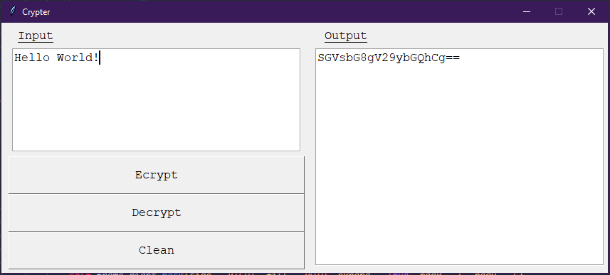

# Crypter in Python



## Required Libraries
### Pybase64 https://pybase64.readthedocs.io/en/v1.2.0/
```python
pip install pybase64
```

## Contributing
Please give feedbacks, pull requests are welcome. For major changes, please open an issue first to discuss what you would like to change.
